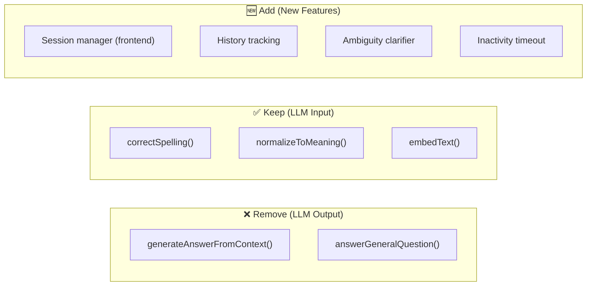

# 🔍 Gap Analysis — Chatbot System vs Final Requirements

> **Scope:** `admin` + `chatbot-backend-admin-panel` + `frontend Code`
> **Date:** 2026-02-13

---

## 📁 Complete File Inventory

````carousel
### Admin Panel (`/admin`)
| File | Lines | Purpose |
|---|---|---|
| [index.html](file:///d:/Thiyo/Chatbot/10-02-26%20Cloned%20from%20Git/admin/index.html) | 40 | Login page (Supabase Auth) |
| [admin.html](file:///d:/Thiyo/Chatbot/10-02-26%20Cloned%20from%20Git/admin/admin.html) | 13K | Main dashboard + tabs |
| [intents.html](file:///d:/Thiyo/Chatbot/10-02-26%20Cloned%20from%20Git/admin/intents.html) | ~7K | Intents list/editor |
| [dashboard.html](file:///d:/Thiyo/Chatbot/10-02-26%20Cloned%20from%20Git/admin/dashboard.html) | ~4K | Stats overview |
| [import.html](file:///d:/Thiyo/Chatbot/10-02-26%20Cloned%20from%20Git/admin/import.html) | ~3K | JSON bulk import |
| [duplicates.html](file:///d:/Thiyo/Chatbot/10-02-26%20Cloned%20from%20Git/admin/duplicates.html) | ~2K | Duplicate flags |
| [js/intents.js](file:///d:/Thiyo/Chatbot/10-02-26%20Cloned%20from%20Git/admin/js/intents.js) | 416 | CRUD + 9-question validation |
| [js/import.js](file:///d:/Thiyo/Chatbot/10-02-26%20Cloned%20from%20Git/admin/js/import.js) | 160 | JSON import with validation |
| [js/duplicates.js](file:///d:/Thiyo/Chatbot/10-02-26%20Cloned%20from%20Git/admin/js/duplicates.js) | 151 | Duplicate review/resolve |
| [js/dashboard.js](file:///d:/Thiyo/Chatbot/10-02-26%20Cloned%20from%20Git/admin/js/dashboard.js) | 62 | Stats counters |
| [js/auth.js](file:///d:/Thiyo/Chatbot/10-02-26%20Cloned%20from%20Git/admin/js/auth.js) | 60 | Login + session guard |
| [js/config.js](file:///d:/Thiyo/Chatbot/10-02-26%20Cloned%20from%20Git/admin/js/config.js) | 4 | Supabase credentials |
| [js/supabaseClient.js](file:///d:/Thiyo/Chatbot/10-02-26%20Cloned%20from%20Git/admin/js/supabaseClient.js) | 12 | Client init |
| [css/admin.css](file:///d:/Thiyo/Chatbot/10-02-26%20Cloned%20from%20Git/admin/css/admin.css) | ~8K | Admin dashboard styling |
<!-- slide -->
### Backend (`/chatbot-backend-admin-panel`)
| File | Lines | Purpose |
|---|---|---|
| [server.js](file:///d:/Thiyo/Chatbot/10-02-26%20Cloned%20from%20Git/chatbot-backend-admin-panel/server.js) | 31 | Express app entry |
| [controllers/chatController.js](file:///d:/Thiyo/Chatbot/10-02-26%20Cloned%20from%20Git/chatbot-backend-admin-panel/controllers/chatController.js) | 367 | Main chat pipeline |
| [controllers/aiIntentRouter.js](file:///d:/Thiyo/Chatbot/10-02-26%20Cloned%20from%20Git/chatbot-backend-admin-panel/controllers/aiIntentRouter.js) | 163 | Navigation intent detection |
| [controllers/publishController.js](file:///d:/Thiyo/Chatbot/10-02-26%20Cloned%20from%20Git/chatbot-backend-admin-panel/controllers/publishController.js) | 104 | Embedding publisher |
| [controllers/duplicateController.js](file:///d:/Thiyo/Chatbot/10-02-26%20Cloned%20from%20Git/chatbot-backend-admin-panel/controllers/duplicateController.js) | 17 | Duplicate scan trigger |
| [services/geminiService.js](file:///d:/Thiyo/Chatbot/10-02-26%20Cloned%20from%20Git/chatbot-backend-admin-panel/services/geminiService.js) | 470 | IUI Engine v2.5 |
| [services/aiService.js](file:///d:/Thiyo/Chatbot/10-02-26%20Cloned%20from%20Git/chatbot-backend-admin-panel/services/aiService.js) | 73 | AI facade |
| [services/supabaseService.js](file:///d:/Thiyo/Chatbot/10-02-26%20Cloned%20from%20Git/chatbot-backend-admin-panel/services/supabaseService.js) | 20 | DB client |
| [services/duplicateService.js](file:///d:/Thiyo/Chatbot/10-02-26%20Cloned%20from%20Git/chatbot-backend-admin-panel/services/duplicateService.js) | 87 | Duplicate detection |
| [setup_rpc.sql](file:///d:/Thiyo/Chatbot/10-02-26%20Cloned%20from%20Git/chatbot-backend-admin-panel/setup_rpc.sql) | 32 | pgvector RPC function |
<!-- slide -->
### Frontend (`/frontend Code`)
| File | Lines | Purpose |
|---|---|---|
| [Chatbot.js](file:///d:/Thiyo/Chatbot/10-02-26%20Cloned%20from%20Git/frontend%20Code/Chatbot.js) | 145 | Widget loader |
| [js/chat.js](file:///d:/Thiyo/Chatbot/10-02-26%20Cloned%20from%20Git/frontend%20Code/js/chat.js) | 283 | Message handler |
| [js/ui.js](file:///d:/Thiyo/Chatbot/10-02-26%20Cloned%20from%20Git/frontend%20Code/js/ui.js) | 268 | Chat UI system |
| [js/vista.js](file:///d:/Thiyo/Chatbot/10-02-26%20Cloned%20from%20Git/frontend%20Code/js/vista.js) | 160 | Panorama/Project nav |
| [js/config.js](file:///d:/Thiyo/Chatbot/10-02-26%20Cloned%20from%20Git/frontend%20Code/js/config.js) | 5 | API URL |
| [js/sound.js](file:///d:/Thiyo/Chatbot/10-02-26%20Cloned%20from%20Git/frontend%20Code/js/sound.js) | 22 | Audio feedback |
| [css/style.css](file:///d:/Thiyo/Chatbot/10-02-26%20Cloned%20from%20Git/frontend%20Code/css/style.css) | 739 | Widget styling |
| [locale/en.txt](file:///d:/Thiyo/Chatbot/10-02-26%20Cloned%20from%20Git/frontend%20Code/locale/en.txt) | 31 | Panorama labels |
| [Links.json](file:///d:/Thiyo/Chatbot/10-02-26%20Cloned%20from%20Git/frontend%20Code/Links.json) | 21 | Project URLs |
````

---

## 📊 Requirement-by-Requirement Gap Analysis

### Legend
- ✅ **PASS** — Fully implemented and working
- ⚠️ **PARTIAL** — Partially done, has gaps
- ❌ **FAIL** — Not implemented or broken

---

### 1️⃣ Meaning Understanding

| Aspect | Status | Evidence |
|---|---|---|
| Semantic vector search | ✅ PASS | `text-embedding-004` → 768-dim vectors → pgvector cosine similarity |
| Different phrasings match same intent | ✅ PASS | 9 question variations per intent ensure coverage |
| Spelling correction | ✅ PASS | 3-layer pipeline: preClean → splitMergedWords → localSpellFix (+ LLM for >5 word queries) |
| Meaning normalization | ✅ PASS | `normalizeToMeaning()` in [geminiService.js#L332](file:///d:/Thiyo/Chatbot/10-02-26%20Cloned%20from%20Git/chatbot-backend-admin-panel/services/geminiService.js#L332) |

> [!NOTE]
> This requirement is **well implemented**. The IUI Engine v2.5 has robust multi-layer text understanding.

---

### 2️⃣ Strict Database-Only Answers

| Aspect | Status | Evidence |
|---|---|---|
| Answers come from DB | ⚠️ PARTIAL | Primary answers from `answers` table via Supabase RPC |
| No generation / external knowledge | ⚠️ PARTIAL | **GAP:** Gemini is used to *rewrite* DB answers for complex queries (>4 words) in [chatController.js#L329](file:///d:/Thiyo/Chatbot/10-02-26%20Cloned%20from%20Git/chatbot-backend-admin-panel/controllers/chatController.js#L329) — `generateAnswerFromContext()` |
| No creative additions | ⚠️ PARTIAL | **GAP:** RAG synthesis can rephrase/add polish to DB answers |
| Fallback message | ⚠️ PARTIAL | **GAP:** `answerGeneralQuestion()` in [geminiService.js#L430](file:///d:/Thiyo/Chatbot/10-02-26%20Cloned%20from%20Git/chatbot-backend-admin-panel/services/geminiService.js#L430) calls Gemini LLM as fallback — can generate non-DB answers for non-school topics |

> [!WARNING]
> **Critical gap:** The requirement says "No generation. No external knowledge." But the current system uses Gemini LLM in two places:
> 1. **RAG Synthesis** — rewrites DB answers into natural language (could alter meaning)
> 2. **General fallback** — calls Gemini for unmatched queries (could generate external knowledge)
>
> **Required fix:** Remove LLM generation layer. Return raw DB answers only. Use fixed fallback string.

---

### 3️⃣ Continuous Chat Support (Context Awareness)

| Aspect | Status | Evidence |
|---|---|---|
| Context from previous turns | ⚠️ PARTIAL | Backend has `history` parameter + context anchoring in [chatController.js#L49-L112](file:///d:/Thiyo/Chatbot/10-02-26%20Cloned%20from%20Git/chatbot-backend-admin-panel/controllers/chatController.js#L49-L112) |
| "they" = last entity resolution | ⚠️ PARTIAL | Anchor keywords lock to entity (canteen, hostel, etc.) — but only for ≤5 word follow-ups |
| Frontend sends history | ❌ FAIL | **GAP:** [chat.js](file:///d:/Thiyo/Chatbot/10-02-26%20Cloned%20from%20Git/frontend%20Code/js/chat.js#L63) sends `{ question, panoNames, projectNames }` — **does NOT send `history`** |
| Store last matched intent | ❌ FAIL | No session/intent tracking on frontend or backend |

> [!CAUTION]
> **Context awareness is designed but disconnected.** The backend accepts `history` parameter and has anchor logic, but the frontend **never sends conversation history**. This means context memory is completely non-functional in production.

---

### 4️⃣ CRUD Support (Admin Control)

| Aspect | Status | Evidence |
|---|---|---|
| Add new Q&A | ✅ PASS | [intents.js](file:///d:/Thiyo/Chatbot/10-02-26%20Cloned%20from%20Git/admin/js/intents.js) — `openEditor()` + `saveDraft()` |
| Update Q&A | ✅ PASS | `editIntent()` → update questions/answers individually |
| Delete Q&A | ✅ PASS | `deleteIntent()` with confirmation |
| Re-embed on update | ✅ PASS | Publish triggers `POST /api/publish` → generates new embeddings |
| No retraining required | ✅ PASS | Just publish to go live |
| Strict 9-question validation | ✅ PASS | Both editor (`saveDraft`) and import validate exactly 9 questions |
| Bulk operations | ✅ PASS | Select-all, bulk publish, bulk delete, "Publish All Drafts" |
| JSON import | ✅ PASS | `import.js` with format normalization + strict validation |
| Duplicate detection | ✅ PASS | Backend semantic scan + admin review UI |

> [!TIP]
> CRUD is the **strongest area**. Very well implemented with professional validation, bulk operations, and duplicate detection.

---

### 5️⃣ Similarity Threshold Logic

| Aspect | Status | Evidence |
|---|---|---|
| Semantic similarity matching | ✅ PASS | pgvector cosine distance via `match_embeddings` RPC |
| Confidence threshold | ⚠️ PARTIAL | Two thresholds exist: `match_threshold: 0.45` (RPC) and `MIN_CONFIDENCE_FLOOR: 0.55` (domain guard) |
| Below threshold → fallback | ⚠️ PARTIAL | **GAP:** Threshold is `0.55`, not `≥ 0.85` as specified. Low-confidence answers may slip through |
| No low-confidence answering | ⚠️ PARTIAL | Domain guard blocks \<0.55, but 0.55-0.82 range returns "broad query" list which may include weak matches |

> [!IMPORTANT]
> **Threshold mismatch.** The requirement specifies **≥ 0.85** confidence. Current system:
> - RPC accepts matches above **0.45**
> - Domain guard floor is **0.55**
> - "Strong match" threshold is **0.82**
>
> This means matches in the 0.45–0.85 range can be returned, violating the strict threshold rule.

---

### 6️⃣ Ambiguity Handling

| Aspect | Status | Evidence |
|---|---|---|
| Detect close matches | ⚠️ PARTIAL | Top-5 list logic shows multiple matches when confidence is moderate |
| Ask clarification question | ❌ FAIL | **GAP:** System returns a **list of answers**, not a **clarification question**. e.g., it does NOT ask "Did you mean school timing or hostel timing?" — it just dumps both answers |

> [!WARNING]
> **Ambiguity clarification is missing.** When two intents are close, the system should ask the user to clarify. Currently it returns all answers as a list, which does not help the user disambiguate.

---

### 7️⃣ Session-Based Conversation

| Aspect | Status | Evidence |
|---|---|---|
| Store previous 3–5 intents | ❌ FAIL | No session storage anywhere (no `sessionStorage`, no server-side sessions, no DB session table) |
| Topic continuity | ❌ FAIL | Frontend doesn't track or send history |
| Inactivity timeout (10–15 min) | ❌ FAIL | No timeout logic exists |
| Per-user session isolation | ❌ FAIL | Backend is stateless — no session concept |

> [!CAUTION]
> **Session management is completely absent.** The system is fully stateless. Every request is independent with no memory of previous interactions. This is the **biggest gap** in the entire system.

---

### 8️⃣ Performance Expectations

| Aspect | Status | Evidence |
|---|---|---|
| Response \<300ms | ⚠️ PARTIAL | DB-only path (short queries) is fast. But Gemini API calls (spelling correction, normalization, RAG synthesis) add 500ms-2s each |
| 95%+ semantic accuracy | ⚠️ PARTIAL | 9 question variants + embedding search should give good accuracy, but no measurement exists |
| Zero hallucination | ⚠️ PARTIAL | **GAP:** RAG synthesis and general fallback use Gemini LLM, which CAN hallucinate |
| 5,000 Q&A scale | ✅ PASS | pgvector + Supabase architecture scales well to 5K+ |

---

### 9️⃣ "No LLM Generation Layer"

| Aspect | Status | Evidence |
|---|---|---|
| System is NOT a generative AI | ❌ FAIL | **GAP:** Uses Gemini generative AI in 4 places |
| Deterministic output | ❌ FAIL | RAG synthesis produces different outputs for same input |
| Only stored answers | ❌ FAIL | LLM rewrites stored answers |

**Current Gemini LLM usage (should be removed per requirement):**

| # | Function | File | Line |
|---|---|---|---|
| 1 | `correctSpelling()` | [geminiService.js](file:///d:/Thiyo/Chatbot/10-02-26%20Cloned%20from%20Git/chatbot-backend-admin-panel/services/geminiService.js#L248) | L248 |
| 2 | `normalizeToMeaning()` | [geminiService.js](file:///d:/Thiyo/Chatbot/10-02-26%20Cloned%20from%20Git/chatbot-backend-admin-panel/services/geminiService.js#L332) | L332 |
| 3 | `generateAnswerFromContext()` | [geminiService.js](file:///d:/Thiyo/Chatbot/10-02-26%20Cloned%20from%20Git/chatbot-backend-admin-panel/services/geminiService.js#L372) | L372 |
| 4 | `answerGeneralQuestion()` | [geminiService.js](file:///d:/Thiyo/Chatbot/10-02-26%20Cloned%20from%20Git/chatbot-backend-admin-panel/services/geminiService.js#L430) | L430 |

> [!NOTE]
> Items 1 & 2 (spelling/normalization) are debatable — they improve *input understanding* without generating answers. Items 3 & 4 directly violate the "no generation" rule.

---

## 📊 Overall Scorecard

| # | Requirement | Status | Score |
|---|---|---|---|
| 1 | Meaning Understanding | ✅ PASS | 10/10 |
| 2 | Strict DB-Only Answers | ⚠️ PARTIAL | 5/10 |
| 3 | Context Awareness | ⚠️ PARTIAL | 3/10 |
| 4 | CRUD Support | ✅ PASS | 10/10 |
| 5 | Similarity Threshold | ⚠️ PARTIAL | 6/10 |
| 6 | Ambiguity Handling | ❌ FAIL | 2/10 |
| 7 | Session-Based Conversation | ❌ FAIL | 0/10 |
| 8 | Performance | ⚠️ PARTIAL | 6/10 |
| 9 | No LLM Generation | ❌ FAIL | 3/10 |
| | **Overall** | | **45/90 (50%)** |

---

## 🔥 Priority Action Plan

### P0 — Critical (Violates core requirements)

| # | Action | Effort |
|---|---|---|
| 1 | **Remove `generateAnswerFromContext()`** — return raw DB `answer_text` directly | Small |
| 2 | **Remove `answerGeneralQuestion()` LLM fallback** — use fixed string: *"I can only answer Montfort School related questions."* | Small |
| 3 | **Add session management** — frontend must track `history[]` of last 5 turns and send with every request | Medium |
| 4 | **Raise confidence threshold** from 0.55 → 0.85 | Small |

### P1 — Important (Missing required features)

| # | Action | Effort |
|---|---|---|
| 5 | **Add ambiguity clarification** — when top 2 matches are close (\<0.05 apart), return "Did you mean X or Y?" instead of a list | Medium |
| 6 | **Add session timeout** — clear `history[]` after 10–15 min inactivity | Small |
| 7 | **Store last matched intent** on frontend — use it for follow-up resolution | Small |

### P2 — Recommended (Improves quality)

| # | Action | Effort |
|---|---|---|
| 8 | Decide on LLM spelling/normalization — keep for input understanding or remove for full determinism | Decision |
| 9 | Fix frontend `chat.js` to send `history` array to backend | Small |
| 10 | Add response time monitoring / logging | Small |

---

## 🧠 Key Decision Required

> **For the LLM spelling/normalization (items 1 & 2 in geminiService.js):**
>
> The requirement says "No LLM generation layer" but spelling correction and query normalization are about *understanding input*, not *generating answers*. Removing them would make the chatbot unable to handle typos and poor grammar.
>
> **Options:**
> - **A)** Keep LLM for input understanding only (spelling + normalization), remove for output (answer generation + fallback)
> - **B)** Remove all LLM usage — rely only on local typo map + raw embedding search
>
> **Recommendation:** Option A — keep input understanding, remove output generation.

---

## 🔗 Code Changes Summary


