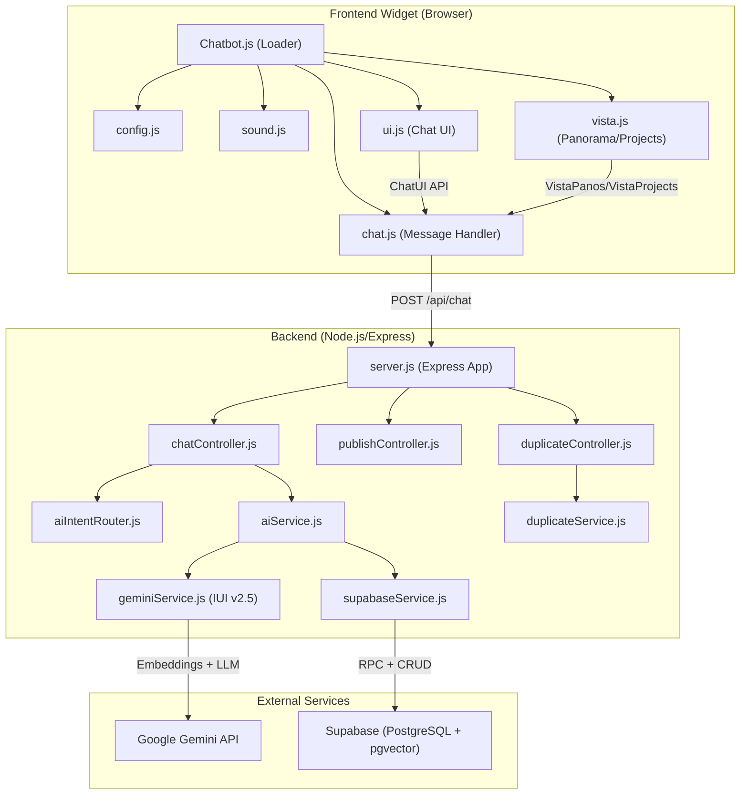
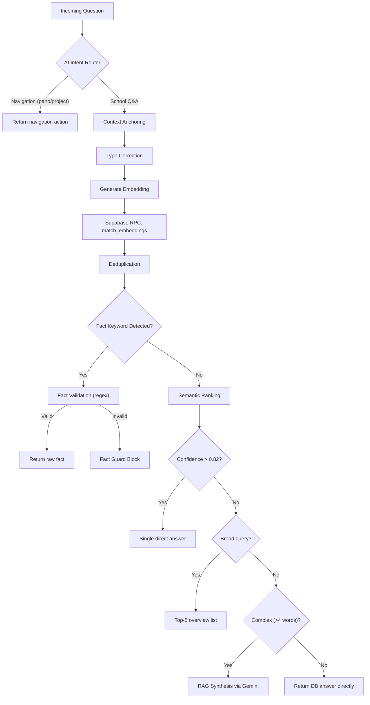
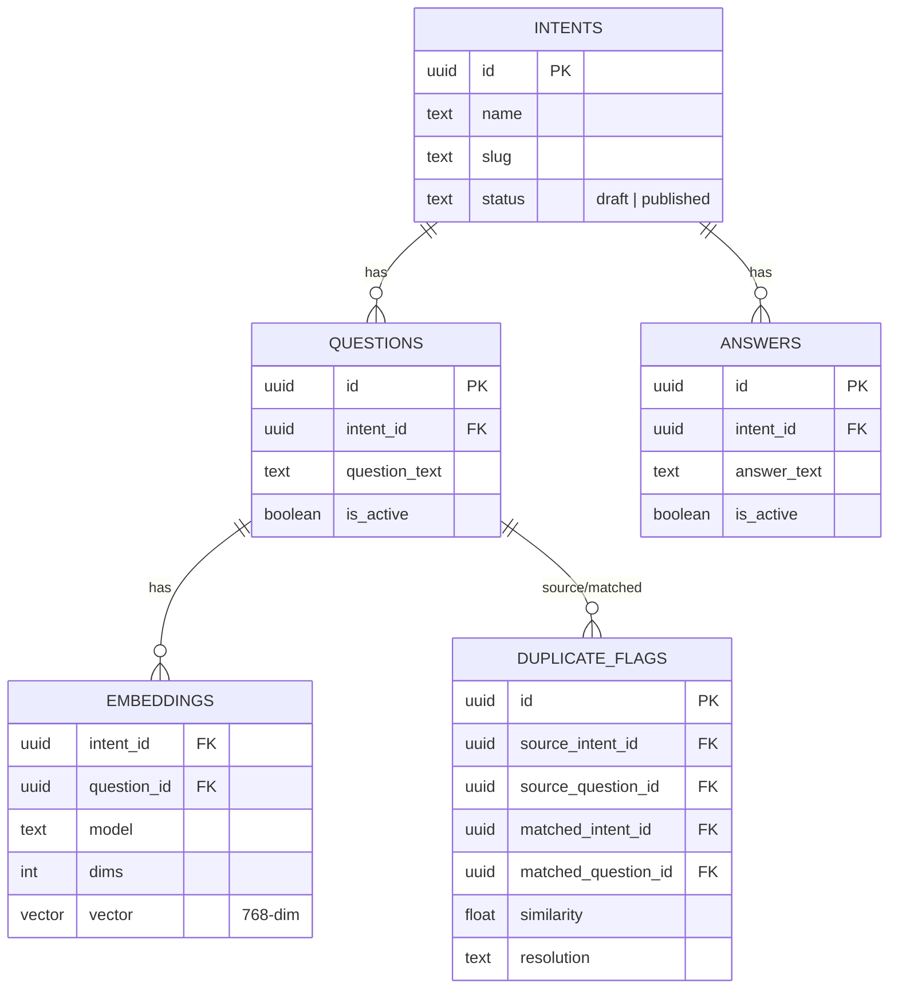
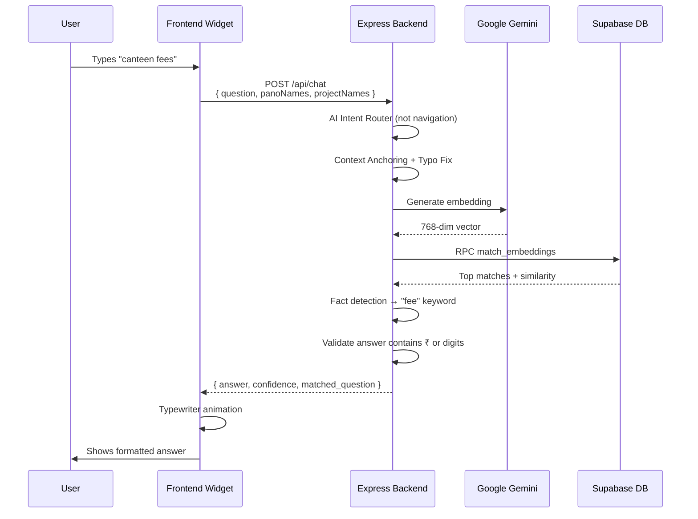

# 🔍 Montfort ICSE Chatbot — Full Project Analysis

> **Scope:** `chatbot-backend-admin-panel` (Backend) + `frontend Code` (Widget)

---

## 🏗️ System Architecture Overview



---

## 📦 Backend — `chatbot-backend-admin-panel`

| Property | Value |
|---|---|
| **Runtime** | Node.js (ES Modules) |
| **Framework** | Express 4.19 |
| **AI Provider** | Google Gemini (`gemini-flash-latest` + `text-embedding-004`) |
| **Database** | Supabase (PostgreSQL with pgvector) |
| **Architecture** | Hybrid RAG (Retrieval-Augmented Generation) |

### File-by-File Breakdown

---

#### [server.js](file:///d:/Thiyo/Chatbot/10-02-26%20Cloned%20from%20Git/chatbot-backend-admin-panel/server.js) — Entry Point (31 lines)

Express app with **3 API routes**:
- `POST /api/chat` → [chatHandler](file:///d:/Thiyo/Chatbot/10-02-26%20Cloned%20from%20Git/chatbot-backend-admin-panel/controllers/chatController.js)
- `POST /api/publish` → [publishIntent](file:///d:/Thiyo/Chatbot/10-02-26%20Cloned%20from%20Git/chatbot-backend-admin-panel/controllers/publishController.js) (bulk embedding generation)
- `POST /api/scan-duplicates` → [scanDuplicates](file:///d:/Thiyo/Chatbot/10-02-26%20Cloned%20from%20Git/chatbot-backend-admin-panel/controllers/duplicateController.js)

> [!NOTE]
> CORS is set to `origin: "*"` — wide open. The comment says "restrict in production".

---

#### [chatController.js](file:///d:/Thiyo/Chatbot/10-02-26%20Cloned%20from%20Git/chatbot-backend-admin-panel/controllers/chatController.js) — Core Chat Pipeline (367 lines)

The **brain** of the system. Handles each chat request through a multi-stage pipeline:



**Key features implemented:**
1. **Context Anchoring** — Locks conversation to last entity (canteen, hostel, library, etc.) for follow-up queries
2. **Fact Detection** — Boosts `match_count` to 20 for phone/email/fee queries
3. **Lightweight Typo Map** — Local fixes for `whatapp→whatsapp`, `moble→mobile` without API calls
4. **Regex Fact Validation** — Ensures phone answers contain digits, emails contain `@`, etc.
5. **Fact Guard** — Blocks policy/generic answers when specific facts are requested but unavailable
6. **Domain Validity Floor** — Min confidence 0.55 to prevent random answers to unknown queries
7. **Top-5 Overview** — Broad/ambiguous queries get a formatted list instead of single answer
8. **RAG Synthesis** — Complex queries (>4 words) get Gemini-rewritten natural language answers
9. **Deduplication** — Filters identical `answer_text` across matches

---

#### [aiIntentRouter.js](file:///d:/Thiyo/Chatbot/10-02-26%20Cloned%20from%20Git/chatbot-backend-admin-panel/controllers/aiIntentRouter.js) — Navigation Intent (163 lines)

Detects if the user wants to **navigate** (e.g., "go to library") vs **ask a question** (e.g., "library timing"):
- Navigation verbs: `go to`, `open`, `show`, `view`, `take me to`, `navigate`, `visit`
- **Levenshtein fuzzy matching** (distance ≤ 2) against panorama/project names
- **Auto-correct** target names (distance ≤ 3)
- Returns `{ intent: "pano" | "project" | "school", target?: string }`

---

#### [publishController.js](file:///d:/Thiyo/Chatbot/10-02-26%20Cloned%20from%20Git/chatbot-backend-admin-panel/controllers/publishController.js) — Embedding Publisher (104 lines)

Admin tool for publishing Q&A intents:
1. Transitions intent status from `draft → published`
2. Fetches all active questions for the intent
3. Generates embeddings via `text-embedding-004`
4. Upserts vectors into `embeddings` table
5. Supports **bulk publishing** (array of intent IDs)

---

#### [geminiService.js](file:///d:/Thiyo/Chatbot/10-02-26%20Cloned%20from%20Git/chatbot-backend-admin-panel/services/geminiService.js) — IUI Engine v2.5 (470 lines)

The most complex service file. **Input Understanding & Intelligence engine** with multiple layers:

| Layer | Function | Purpose |
|---|---|---|
| 0 | `preClean()` | Strip zero-width chars, normalize quotes, remove emojis |
| 1 | `splitMergedWords()` | Split "canteenin" → "canteen in" using DB vocabulary |
| 2 | `localSpellFix()` | Levenshtein-based typo fix against DB vocabulary (≤40% distance) |
| 3 | `correctSpelling()` | LLM-based strict spelling correction (no noun swaps) |
| 4 | `normalizeToMeaning()` | LLM rewrite preserving meaning ("wesiet" → "website") |
| 5 | `generateAnswerFromContext()` | RAG synthesis from retrieved facts |
| 6 | `answerGeneralQuestion()` | School-safe fallback (blocks non-school hallucinations) |
| 7 | `embedText()` | 768-dim vector generation via `text-embedding-004` |

**Resilience features:**
- **Rate Limit Circuit Breaker** — 60s cooldown after 429 errors
- **Vocabulary loaded from DB** — Not hardcoded; auto-adapts to new Q&A data
- **LLM output validation** — Rejects Gemini corrections that shrink response by >3 words

---

#### [aiService.js](file:///d:/Thiyo/Chatbot/10-02-26%20Cloned%20from%20Git/chatbot-backend-admin-panel/services/aiService.js) — Facade (73 lines)

Wrapper that consolidates all AI functions:
- `correctGrammar()` — Light grammar/spelling fix
- `generateEmbedding()` / `generateEmbeddingsBatch()` — Vector generation
- Re-exports `normalizeToMeaning`, `generateAnswerFromContext`, `answerGeneralQuestion` from geminiService

---

#### [supabaseService.js](file:///d:/Thiyo/Chatbot/10-02-26%20Cloned%20from%20Git/chatbot-backend-admin-panel/services/supabaseService.js) — DB Client (20 lines)

Supabase admin client using **Service Role Key** (bypasses RLS). Credentials from `.env`.

---

#### [setup_rpc.sql](file:///d:/Thiyo/Chatbot/10-02-26%20Cloned%20from%20Git/chatbot-backend-admin-panel/setup_rpc.sql) — Postgres Function (32 lines)

Creates `find_similar_questions()` RPC:
- Takes a 768-dim query vector, threshold, and count
- Uses pgvector cosine distance (`<=>`) operator
- Returns `(id, question_text, intent_id, similarity)` tuples

---

### Database Schema (Inferred)



---

## 🎨 Frontend — `frontend Code`

| Property | Value |
|---|---|
| **Type** | Embeddable chat widget (self-contained IIFE) |
| **Framework** | Vanilla JS (no dependencies) |
| **Design** | Glassmorphism, dark mode, responsive |
| **Font** | Satoshi (fontshare.com) |
| **Target** | Montfort ICSE School virtual tour integration |

### Script Loading Order

```
Chatbot.js (entry)
  → config.js  (API URL)
  → sound.js   (audio feedback)
  → ui.js      (ChatUI API)
  → vista.js   (VistaPanos/VistaProjects)
  → chat.js    (message handler)
```

### File-by-File Breakdown

---

#### [Chatbot.js](file:///d:/Thiyo/Chatbot/10-02-26%20Cloned%20from%20Git/frontend%20Code/Chatbot.js) — Entry Point / Loader (145 lines)

Self-executing IIFE that:
1. Injects CSS (`css/style.css`)
2. Creates complete DOM structure (toggle button, chat widget with header/messages/form)
3. Creates 4 audio elements (typing, delivered, open, close sounds)
4. Loads all scripts sequentially in correct dependency order

> [!TIP]
> The widget is **fully portable** — just include `Chatbot.js` and it builds its entire UI dynamically.

---

#### [chat.js](file:///d:/Thiyo/Chatbot/10-02-26%20Cloned%20from%20Git/frontend%20Code/js/chat.js) — Message Handler (283 lines)

Handles all user input with a priority pipeline:
1. **Greetings** → Local welcome message (hi, hello, hey, etc.)
2. **Help/Menu** → Local feature guide
3. **Name query** → "I'm your Montfort ICSE Assistant"
4. **List all** → Shows all panoramas & projects as clickable buttons
5. **Backend query** → Sends to `POST /api/chat` with `panoNames` and `projectNames`

Backend responses with `intent: "pano"` or `intent: "project"` trigger Vista navigation.

---

#### [ui.js](file:///d:/Thiyo/Chatbot/10-02-26%20Cloned%20from%20Git/frontend%20Code/js/ui.js) — Chat UI System (268 lines)

Exposes `window.ChatUI` API:
- `createMessageRow(role, text, isHTML)` — Renders user/bot messages with avatars + timestamps
- `showTypingIndicator()` / `hideTypingIndicator()` — Animated 3-dot indicator
- `typeBotMessage(text, speed)` — **Hybrid typewriter**: types plain text character-by-character, then swaps to linkified HTML at the end

**Smart linkification** handles URLs, emails, and phone numbers automatically.

Widget interactions: toggle open/close, click-outside-to-close, Escape key, input disable during bot typing.

---

#### [vista.js](file:///d:/Thiyo/Chatbot/10-02-26%20Cloned%20from%20Git/frontend%20Code/js/vista.js) — Panorama & Project Navigation (160 lines)

Exposes `window.Vista` API:
- `loadPanoLabels()` — Parses `locale/en.txt` for panorama names
- `loadProjects()` — Loads `Links.json` for project URLs
- `openPanorama(label)` — Calls `window.tour.setMediaByName()` (360° tour viewer)
- `openProject(urlOrTitle)` — Opens project URL in new tab
- `findMatchingPano/Project()` — Fuzzy match helpers

Auto-loads panoramas and projects on page load, exposing `window.VistaPanos` and `window.VistaProjects` for the backend intent router.

---

#### [style.css](file:///d:/Thiyo/Chatbot/10-02-26%20Cloned%20from%20Git/frontend%20Code/css/style.css) — Styling (739 lines)

| Section | Key Features |
|---|---|
| **FAB Button** | 64px circle, gradient (#001166→#1e3a8a), pulse animation |
| **Chat Widget** | Glassmorphism (`backdrop-filter: blur(20px)`), slide-in animation, 400px width |
| **Messages** | User=gradient blue, Bot=white with border, animated appearance |
| **Typing** | 3-dot bounce animation |
| **Input** | Rounded textarea, focus glow, disabled state |
| **Send Button** | Gold gradient (#DD9933→#eab308) |
| **Tour List** | Flex grid, gradient buttons with shimmer hover effect |
| **Dark Mode** | Full `prefers-color-scheme: dark` support |
| **Responsive** | 3 breakpoints (768px, 640px, 480px) |
| **Accessibility** | Focus outlines, `aria-label`, `:focus-visible` |

---

## 🔗 Frontend ↔ Backend Integration



---

## ⚠️ Notable Observations

> [!WARNING]
> **Potential Issues Found:**

| # | Area | Issue |
|---|---|---|
| 1 | [publishController.js#L75](file:///d:/Thiyo/Chatbot/10-02-26%20Cloned%20from%20Git/chatbot-backend-admin-panel/controllers/publishController.js#L75) | Duplicate `.eq('is_active', true)` filter (same condition applied twice) |
| 2 | [chatRoute.js](file:///d:/Thiyo/Chatbot/10-02-26%20Cloned%20from%20Git/chatbot-backend-admin-panel/routers/chatRoute.js) | Router file exists but is **not used** — `server.js` registers routes directly |
| 3 | [aiService.js](file:///d:/Thiyo/Chatbot/10-02-26%20Cloned%20from%20Git/chatbot-backend-admin-panel/services/aiService.js) | Creates its own `genAI` instance — duplicates initialization from `geminiService.js` |
| 4 | [chatController.js#L61](file:///d:/Thiyo/Chatbot/10-02-26%20Cloned%20from%20Git/chatbot-backend-admin-panel/controllers/chatController.js#L61) | Duplicate entries in `ANCHOR_KEYWORDS` array (`'lab', 'computer', 'science'` appear twice) |
| 5 | server.js | CORS is `origin: "*"` — should be restricted in production |
| 6 | [en.txt](file:///d:/Thiyo/Chatbot/10-02-26%20Cloned%20from%20Git/frontend%20Code/locale/en.txt) | All 14 panoramas have the **same label** "Montfort School - ICSE/ANGLO INDIAN" — navigation intent matching is effectively broken since all panos map to one name |
| 7 | Frontend | No conversation `history` is sent to backend — context anchoring only works within backend memory per-request |
| 8 | [Links.json](file:///d:/Thiyo/Chatbot/10-02-26%20Cloned%20from%20Git/frontend%20Code/Links.json) | All 4 projects point to the **same URL** (`ruraluniv.ac.in`) — likely placeholder data |
| 9 | Frontend | `chat copy.js` and `vista copy.js` appear to be backup duplicates |
| 10 | CSS | `@keyframes slideInUp` is defined **twice** (lines 104 and 711) |

---

## 📊 Codebase Stats

| Metric | Backend | Frontend | Total |
|---|---|---|---|
| **Source Files** | 10 | 9 | 19 |
| **Lines of Code** | ~1,380 | ~1,690 | ~3,070 |
| **Dependencies** | 5 (express, cors, dotenv, gemini-ai, supabase-js) | 0 (vanilla) | 5 |
| **AI Models Used** | gemini-flash-latest + text-embedding-004 | — | 2 |
